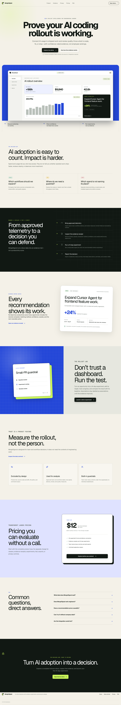
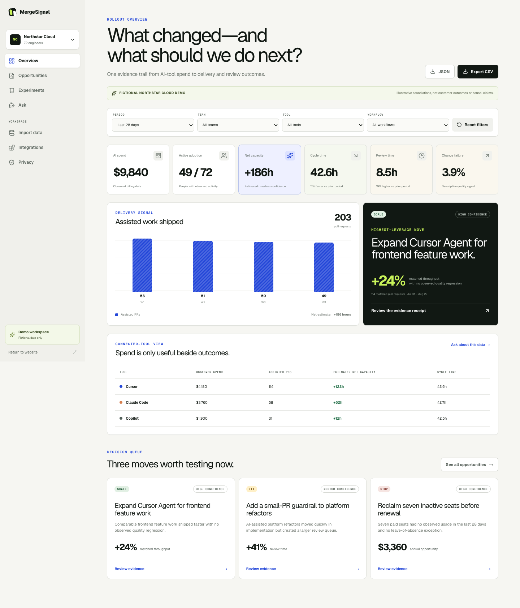

# MergeSignal

**AI rollout intelligence for engineering leaders.** MergeSignal connects approved AI-tool telemetry with delivery and review signals, then shows what to scale, fix, or stop through confidence-rated evidence and reversible 14-day experiments.

This repository contains an original, clean-room competitor inspired by the engineering-intelligence problem Mentlio addresses. It does not copy Mentlio's brand, code, copy, proprietary metrics, or visual trade dress.



## What works

- A conversion-focused landing page with original positioning, transparent pricing, privacy commitments, FAQ, metadata, and social preview.
- A no-login fictional Northstar Cloud workspace with deterministic spend, adoption, delivery, review, and quality measures.
- Period, team, tool, and workflow filters with reset and protected small-cohort states.
- Evidence receipts showing sample size, matched comparison, confidence, caveats, and a reversible next action.
- Persistent 14-day experiments whose target and status survive reloads.
- Deterministic Ask analytics with record citations and an honest unsupported-question state.
- Local-only CSV/JSON preview with an allowlisted schema, input limits, formula-injection protection, and rejection of prompts, source code, diffs, paths, and outputs.
- Safe aggregate CSV/JSON exports with minimum-cohort enforcement at the export boundary.
- Honest integration previews and persistent privacy-policy controls; no fake OAuth connections.
- Responsive navigation, reduced-motion support, keyboard focus, semantic chart summaries, and automated WCAG checks.



## Run locally

Requirements: Node.js 22.13 or newer and npm.

```bash
cd web
npm ci
npm run dev
```

Open [http://localhost:3000](http://localhost:3000). The demo needs no account, secret, database, or third-party connection.

## Quality gates

```bash
cd web
npm run lint
npm run typecheck
npm run test:run
npm run build
npm run audit
npm run e2e
```

The test suite covers domain calculations, cohort suppression, Ask routing, import/export security, local persistence, component behavior, nine end-to-end decision journeys, nine route-level accessibility audits, and desktop/tablet/mobile screenshots.

## Product routes

| Route | Purpose |
|---|---|
| `/` | Public landing page |
| `/app` | Filterable rollout overview and exports |
| `/app/opportunities` | Scale, fix, and stop decision queue |
| `/app/opportunities/:id` | Transparent evidence receipt |
| `/app/experiments` | Persistent 14-day experiments |
| `/app/ask` | Cited deterministic analytics |
| `/app/import` | Local-only bounded telemetry preview |
| `/app/integrations` | Honest production-connection contracts |
| `/app/privacy` | Retention, cohort, and field-level policy |

## Product and engineering notes

- [Product brief](docs/PRODUCT_BRIEF.md)
- [Architecture and trust boundaries](docs/ARCHITECTURE.md)
- [Security policy](SECURITY.md)
- [Acceptance contract](docs/task-contracts/mergesignal-v1.md)
- [Mentlio public-surface research](research/MENTLIO_OSINT.md)

All Northstar Cloud figures are deterministic fictional data. They illustrate product behavior, not customer outcomes or causal findings. Public competitor captures and downloaded references remain under `research/`; none are imported by the shipped application.
